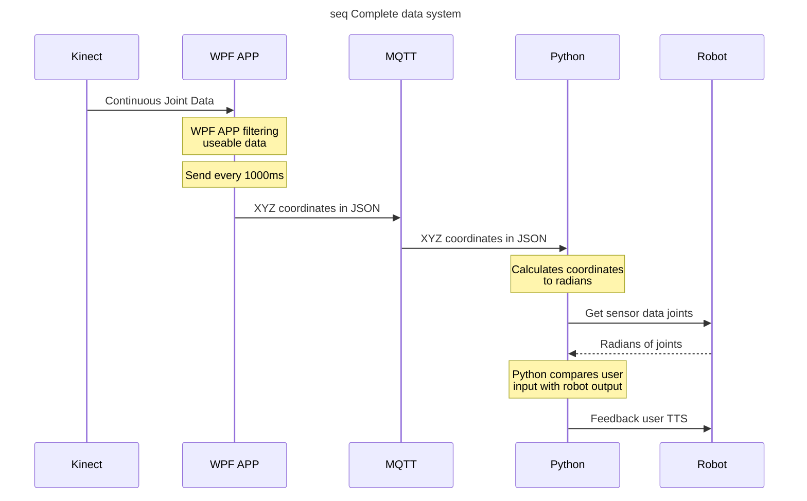

# NAO Design report
*The personal home trainer for Tai Chi*

## Abstract
An urban upmarket health club needs a personal robot that its clients can take home to practice the Tai Chi 10-form. The robot that the prototype uses is a NAO from SolidBank. Research has been done on how to implement a vision system for the NAO and communication. After carefully considering what aspects are most important for a Tai Chi teacher a final concept has been worked out. This is not a finished product, but a prove of concept.

This concept has the following features:
  - The NAO mimics human behaviour
  - The NAO responds to its given name: Blue
  - Blue is a happy young robot
  - Five forms of the 10-form can be taught and forms have fluent transitions
  - Blue uses a Kinect to give feedback on your position and summarizes it's evaluation at the and of the training
  - Blue is able to recognize and remember the faces of it's users
  - The NAO understands Tai Chi related sentences in multiple ways. This way foreign users who's first language is not English can use the NAO without problems.

State machine and activity diagrams have been made to show the functions the robot possesses. These can be found in appendix A.

Results of all the requirements are as follows:
  * Total requirements:   11
  * Pass:                 8
  * Fail:                 1 (*Wish*)
  * Untested:             2 (*Expected to pass for the demonstration*)

The two most important recommendations for a finished user friendly product are:
**Different robots**
The NAO robot overheats too fast. When used for training, without any ways of cooling it, the NAO can be used for about ten minutes before it's joints get too lose to have it to perform the 10-form.
**Compact hardware**
Right now a program is run on a laptop and RaspberryPi and the Kinect camera needs to be placed on the ground near the robot. For every user this is a pain to setup correctly. Therefor it is recommended to combine all these components into a small box with every program running on the RaspberryPi. This way the user only has to plug the box into a power outlet and optionally into an internet router and the setup is done.

## Table of contents
- [NAO Design report](#nao-design-report)
  * [Abstract](#abstract)
  * [Table of contents](#table-of-contents)
  * [1. Introduction](#1-introduction)
  * [2. Preparation](#2-preparation)
    + [2.1 Function Analysis](#21-function-analysis)
    + [2.2 Set of requirements](#22-set-of-requirements)
    + [2.3 Validating requirements (Just)](#23-validating-requirements--just-)
  * [3. Researched topics](#3-researched-topics)
    + [3.1 Vision](#31-vision)
    + [3.2 Speech](#32-speech)
  * [4 Concepts](#4-concepts)
    + [4.1 Morphological Analysis](#41-morphological-analysis)
    + [4.2 Concepts](#42-concepts)
    + [4.3 Detailed description of concepts](#43-detailed-description-of-concepts)
  * [5 Considerations](#5-considerations)
    + [5.1 Weightings](#51-weightings)
    + [5.2 Score table](#52-score-table)
    + [5.3 Final concept (concept conclusion)](#53-final-concept--concept-conclusion-)
    + [5.4 System Diagrams](#54-system-diagrams)
  * [6. Elaboration](#6-elaboration)
    + [6.1 Social interaction (Just)](#61-social-interaction--just-)
    + [6.2 Angle Calculations (Jens)](#62-angle-calculations--jens-)
    + [6.3 System hierarchy (Toni/Tristan)](#63-system-hierarchy--toni-tristan-)
    + [6.4 Vision (Toni/Tristan)](#64-vision--toni-tristan-)
    + [6.5 Poses (Just/Jens)](#65-poses--just-jens-)
  * [7. Conclusion](#7-conclusion)
    + [7.1 Results (Just)](#71-results--just-)
    + [7.2 Recommendations](#72-recommendations)
    + [7.3 Final Conclusion](#73-final-conclusion)
  * [References](#references)
  * [Appendix](#appendix)
    + [A](#a)
    + [B](#b)
    + [C](#c)
    + [D](#d)
    + [E](#e)

## 1. Introduction
An urban upmarket health club gives Tai Chi lessons. When performing Tai Chi it is important to be aware of your posture. During live classes a Sifu (master/teacher) can correct individuals on their poses. At home however, there is nobody to check if you're doing everything correctly.
A NAO robot by SolidBank is a great solution to this problem. NAO is able to move like a human and has the ability to provide live feedback to the user.

GeekySolutions has been asked to design and program the NAO so it can act as a real Tai Chi Sifu. Not only will it be able to move like a human, it will also be programmed to have meaningful interactions with the user. These interactions could be grading and correcting the user's pose, give additional information about Tai Chi and interact with the user in a personal way.
The idea is that students take a NAO home so after the live classes they can practice their pose correctly. This makes them progress much faster and more efficiently since the students still receive live feedback at home.

The structure of this report is as follows. In the second chapter all preparations are made. Chapter 3 is all the research done to come up with concepts which are elaborated in chapter 4. Then in chapter 5 considerations between all concepts are made and a final concept is chosen. This chapter also shows some global system diagrams. Chapter 6 gives all the details about the NAO, what has changed from the initial concept and all the choices made during the realization of the final product. Finally in chapter 7 all requirements are tested and results are noted, recommendations are given and a conclusion is made.  

## 2. Preparation
### 2.1 Function Analysis
In this chapter the basic and sub functions of the NAO Tai Chi master will be explained in detail.
#### Performing the 10-form
The NAO robot has to perform the 10-form in a way that the user knows how to transition from form to form.
#### Tracking movements
The robot is able to track the user's movements and calculate the angles in which the users limbs are positioned in. These angles are compared to his own.
#### Comment on poses
With the information about the angles NAO determines if all the limbs are positioned correctly.  NAO will then determine an appropriate comment on the users movements. The allowed amount of deviation from NAO's angles has to be specified beforehand.
#### Learn faces
When NAO first meets the user it asks personal information about the user. During the meeting it tries to learn and save the users face so it can be recognized in the future.
#### Recognize faces
Once a users face is saved it can recognize the user at any time. A personal greeting will be initiated if NAO knows the user.
#### Track faces
NAO will always try to look at the users face. This makes the robot seem more engaged and it can keep track of who the user in front of it is.
#### Hear
NAO can recognize certain words and phrases and respond to them in a meaningful way.
#### Talk
NAO can talk with the user about their training, Tai Chi and have social conversations.
#### Feel
NAO has a few touch sensors which when touched make the robot react in different ways. These sensors can be used to detect the user or other objects.
### 2.2 Set of requirements
|Manufacture|Functional|Requirements|Fixed|Variable|Extra|
|:--:|:--:|--|:--:|:--:|:--:|
|    | x | NAO is able to recognize pre-defined sentences. | x |   |   |
|    | x | NAO can have at least three different social conversations with the user. |   | x |   |
|    |x  | NAO confirms with the user if the exercise is clear. |   x   |          |       |
| x |    | Certain functions and conversations can be performed through a privacy focussed 3rd party speech recognition API. | |    | x |
|    | x | If the user does not interact with NAO for 30-60 seconds, it will ask if the user still needs its service. |   x   |          |   |
|    |      x     | Users movements can be evaluated and then corrected by the NAO.                                            |       |     x    |       |
|    |      x     | NAO can remember and recognize the users face.                                                             |   x   |          |       |
|    |      x     | The vision software is able to measure the distance from the camera to the user. (+/- 100mm)                |       |     x    |    |
|    |      x     | NAO can demonstrate the postures of the Tai Chi Chuan 10-form.                                                   |   x   |          |       |
| x |            | Transitions between the postures are fluid                                                                 |       |     x    |       |
|    |      x     | When not performing the 10-form, the NAO looks at the user.                                                |   x   |          |       |
### 2.3 Validating requirements (Just)
All requirements have to be met at the end of the design. To test each requirement the following steps are taken:
**1**   All possible inputs are clearly pronounced to the NAO. If it understands 3 different people clearly, this requirement is validated. To check if NAO understands everything clearly the dialog box, containing the received input, is read.
**2**   Any kind of social interaction will suffice. For instance the user may say: "Greetings" "How are you doing?" "Do you know any jokes?". The idea is to make the NAO feel more engaging besides the training program.
**3**   The exercise will be explained before it starts. NAO asks the user beforehand if the goal of the exercise is clear and acts accordingly.
**4**   Most 3rd party speech recognition API's responds to a 'wake word', giving the user access to it's functions. A human-like API, that keeps the user's input private, is needed to validate this requirement.
**5**   This is validated by waiting for the given amount of time and watching how the NAO responds.
**6**   During training, the NAO gives feedback to the user on their posture. It tells them what parts of their body is correctly placed and what part needs adjusting.
**7**   During start-up, the NAO greets the user. This will be a personalized greeting based on if the NAO has recognized their face. If the user's face is not recognized, the NAO will ask questions to the user so it will recognize him or her next time.
**8**   Measuring the distance to the user is validated by manually measuring the distance and comparing it to the distance given by the camera. The requirement is met when the difference between the two distances is consistently less than 100mm.
**9**   Demonstrating the postures of the Tai Chi Chuan 10-form requires the NAO not to fall over during the performance. If all 10 poses are performed without the NAO falling (Does not have to be one after the other), this requirement is met.
**10**  The NAO does not have to return to a fixed position to transition from one form to the next. This transition only has to be fluid for the next form in the 10-form. This means form 1 to form 2, form 4 to form 5 and so on.
**11**  To make the NAO feel more human-like, it looks at the user when not performing the 10-form. This is tested by walking around and following the NAO's head movements.

## 3. Researched topics
### 3.1 Vision
There are variant ways to make a vision program. The NAO robot will need to recognize faces and movements so the camera and program to make the vision part of the robot will be selected with these things in mind.
#### Choregraph
The robot has its own cameras. The software to program these cameras are also very easy to use. there are already basic functions for face learning and recognition build into the software. this will thus be very easy to program. Tracking movements with these cameras is a little harder. There is no build in function for this so this will need to be made from scratch. the cameras also have no 3D vision. making calculations using these cameras will thus be a lot harder.
#### Kinect
The Kinect sensor made by Microsoft for the Xbox console is specifically made to track the movements of people. This could be a very good way to track and calculate the movements of the users. There is also the possibility to recognize faces using a Kinect sensor. The hard part is that the program will need to be made from scratch using python but there are a lot of test programs online for you to use. Also the camera isn't directly connected to the NAO. You will need the use a Raspberry Pi in order to connect the sensor to the robot.
#### Others
There are some other options as well, such as using an external 3D camera. These however are usually very expensive and they are usually not made to track movements so there will not be a lot of programs you can find online. The upside is that they come in any size and shape you want and you could even buy one that you can mount onto the NAO. This is a lot more user friendly.
### 3.2 Speech
#### Speech recognition
Having a conversation between the NAO and the user requires the NAO to have speech recognition. For humans this task is simple. Their brains know what words mean and how to react to them. For robots it is not that simple. Every single word is foreign to them. The pronunciation, meaning and the expected response has to be manually programmed, or at least most of it.
This research covers two ways of speech recognition that the NAO could end up using. These are the built in speech library from Choregraph and chat bots like Google Assistant and Amazon's Alexa.
#### Built in library
Choregraph has a built in feature that allows words written in text to be converted to speech within the NAO. The library used for this feature is *ALSpeechRecognition* in Python. This library is easy to understand, but its drawback is that every word had to be hard coded. It is possible to write different conversations and make them seem spontaneous, however after using the NAO several time these 'spontaneous conversations' get repeated. From that point on NAO's speech starts getting repetitive and static. To counter this NAO's library has to be continuously updated. This is not efficient and more important expensive.
Though these flaws are clearly noticeable, they are not that bad for this particular project. The way these conversations are hard coded is useful when it comes to giving specific feedback, or when teaching something about Tai Chi. Both the input and output have to be programmed in order for this library to function.
In order to give conversations more meaning this library can be combined with many others from the NAOqi Audio set. The most useful ones are listed below:
* **ALTextToSpeech**
		This library is used to let the NAO say words that are written down in the code.
		The easiest way to program this, is to use the *say* block in Choregraph.
* **ALSoundLocalization**
		This identifies the direction of any loud enough sound heard by the robot.
		Useful to have the NAO look in the direction of the user when he/she speaks.
* **ALVoiceEmotionAnalysis**
		This identifies the emotion expressed by the speaker’s voice, independently of what is being said.
		NAO could be made to respond according to the user's expressed emotion.
#### Chat Bots
There also is the option to use a variety of chat bots. these sometimes cost money, but you can also get them for free. This enables the NAO robot to have more complicated conversations and answer any questions that the user might have. This does however come with some privacy problems. Google Cloud is a way to get an easy chatbot going, but everything the user says is stored in Google's database. Some users might not want to have this so this becomes something to take into consideration when designing the robot.

## 4 Concepts
### 4.1 Morphological Analysis
In the table below are listed all the options for different functions of the NAO robot. all the options will be considered while making the final design. at least 3 concepts will be made with different themes. later the concepts will be weight against each other and the best one will be chosen as the final design.
```
| Functions             		| Option 1                             | Option 2                              | Option 2                  | Option 4  |
|---------------------------|--------------------------------------|----------------------------------------|---------------------------|-----------|
| **User recognition**      | OpenCV with 3D webcam (3)            | Kinect connection via MQTT on Rpi      | Build in NAO camera (1,2,4) |           |
| **Movements recognition** | OpenCV with 3D webcam (3)            | Kinect connection via MQTT on Rpi (2,4)| Build in NAO camera (1)   |           |
| **Hearing**               | External microphone on the user (3,4)	 | NAO microphones (1,2)                 |                           |           |
| **Socializing**           | Pre-programmed speech patterns (1,2) | Chatbot (3,4)                           |                           |           |
```

### 4.2 Concepts
1. Cheap
2. Simple
3. High Tech
4. Advanced HMI
### 4.3 Detailed description of concepts
#### Cheap
This concept is the cheapest. This is because it only uses the standard components of the NAO robot itself. The cameras on the head of the robot is used to recognize faces and track the movements of the user. These cameras will not give you the most detailed readings, but they should get the job done. The standard microphone on the NAO works relatively well for the required functions it preforms, but you have to get close enough to the robot so that it can clearly hear and understand you. To have conversations with NAO there will be some pre-programmed speech patterns in the robot's code that the user has to adhere to. Because of this you can't have very complicated conversations, but it takes less work to finish the NAO which lessens the final costs.
#### Simple
The second concept is very simple based. It is the easiest to program but the price will be a little higher because it requires a Kinect sensor and RaspberryPi. To recognize the user's face NAO's camera is used. This because there is already a built in function in the Choregraph software for facial recognition. For the detection of movements however a Kinect sensor is used, which is specifically made for movement tracking. The sensor will have to be connected to the robot via a RaspberryPi and the code will be written in Python. For NAO's hearing and talking Choregraph is used, since all the needed functions are already integrated in there. Because of the addition of a RaspberryPi and Kinect the costs for this concept lay a little higher than the 'cheap' concept.
#### High Tech
The high Tech concept is probably the best option, but it is very hard to produce and also very expensive. This concept does not use the Kinect sensor but a 3D webcam that can be mounted on top of the NAO robot. The code will be programmed using opencv in python or C++. This is very user friendly because The user doesn't have to set up the Kinect on the correct place. This camera will be used for both facial recognition and movement tracking. For the robot to hear there will be a little microphone that the user can clip onto their clothes This microphone will have to be connected to the robot and it costs a little more money. Probably the most useful tool that will be used in this concept is a chatbot such as Google Assistant or Sphinx. This way NAO is not limited by the speech patterns inside the program. This will help the robot to be a lot more user friendly and more fun to use. It can also be used to search for things on Google so that the robot can tell you things you want to know.
#### Advanced HMI
This last concept is an improved version of the 'simple' concept. Mostly the hearing and socializing skills have an option which will result in a better HMI. For Vision it is not necessary to choose the difficult options like a 3D-camera and OpenCV, because this concept is all about the correct and polite interaction between the NAO robot and the human. Though we have chosen not to use the NAO microphone there is a not that much of a difference, depending on which external microphone one would choose. In this particular concept a small Voice Detection sensor will do it, but one can also consider a studio microphone with white noise filters et cetera.

## 5 Considerations
### 5.1 Weightings
The four defined concept now must meet the variable requirements that are defined in the Set of Requirements. The fixed requirements will not weight in in this part of choosing a final concept, because every concept must meet those requirements.
At first the weighting factors of the variable requirements will be determined in table below. These factors will be used in the score table.
```
| Variable requirements 								   | 1 | 2 | 3 | 4 | Total |
| 1.	NAO can have at least three different social conversations with the user.	   | 1 | 1 | 1 | 1 |   4   |
| 2.	Users movements can be evaluated and then corrected by the NAO.			   | 0 | 1 | 1 | 1 |   3   |
| 3.	Transitions between the postures are fluid  					   | 0 | 0 | 1 | 0 |   1   |
| 4.	The vision software is able to measure the distance from the camera to the user.   | 0 | 0 | 1 | 1 |   2   |
```
### 5.2 Score table
Now the concepts get a rating from one till five for how well a concept meets the requirement. The weighting factor will be multiplied by this rating and result a final score. When one compares these scores to the ideal outcome of this table a choice can be made.

As shown below the concepts 'High-Tech' and 'Advanced HMI' have a significantly higher score then the other two. They also are very close to the ideal score. In 5.3 a final concept will be concluded out of these results.
```
| Variable requirements 								   | Scores | Cheap | Simple | High-Tech | Advanced HMI |  Ideal  |
|------------------------------------------------------------------------------------------|
| 1.	NAO can have at least three different social conversations with the user.	   |   4    | 3(12) |  3(12) |   5(20)   |   5(20)      |  5(20)  |
| 2.	Users movements can be evaluated and then corrected by the NAO.			   |   3    | 2(6)  |  3(9)  |   4(12)   |   3(9)       |  3(15)  |
| 3.	Transitions between the postures are fluid  					   |   1    | 3(3)  |  3(3)  |   3(3)    |   3(3)       |  5(5)   |
| 4.	The vision software is able to measure the distance from the camera to the user.   |   2    | 1(2)  |  4(8)  |   4(8)    |   4(8)       |  2(10)  |
| Total											   |        | 23    |  32    |   43	 |   40         |   50    |
|---------------------------------------------------------------------------------------------------| 40%   |  64%   |   86%     |   80%        |   100%  |
```
### 5.3 Final concept (concept conclusion)
#### Personality
  Real life Sifu's tend to be strict and serious. This strict way of teaching is not something most people want, when they are in the comfort of their own home. A logical way to make the NAO fit in the relaxed environment at home is to make him happy and even a little funny at times.
  During the training NAO will watch you closely he gives you feedback in a relaxing manner. Not forcing you to improve or always pointing out the mistakes and leave out the positives. Users will feel that they can practice Tai Chi at their own pace.
  When not in training, NAO is happy and occasionally tells jokes. If anything triggers the third party speech software, NAO will run the created text through Choregraph to keep the same tone as he did before the trigger.

#### Vision
After researching the Kinect it is chosen for this project. The Kinect is a 3D camera from which various libraries are available. The investigation revealed that the Kinect provided the perfect starting point for continuing. The Kinect namely provides 3D coordinates of each joint on the body of the user. With the 3D coordinates it is possible to calculate the angels of each joint.

One of the decisive results was the robot's output. It is possible to read angles of the robot with a simple python script using the *ALMemory* module. The difficult part is bringing the inputs and outputs together in the right format at the same point. With the in and outputs at the same point it is possible to compare them and give the user feedback based on him of her performance.

#### A name for NAO
Now that NAO is designed like a human, it's time to give NAO a human name. The name we settled on is Blue, since he (yes, Blue is a he) is coloured blue and blue stands for a healthy and long life in Chinese. This is also a reason people practice Tai Chi. A small detail that adds more meaning to the NAO robot.

#### Personality
Real life Sifu's tend to be strict and serious. This strict way of teaching is not something most people want, when they are in the comfort of their own home. A logical way to make the NAO fit in the relaxed environment at home is to make him happy and even a little funny at times.
During the training NAO will watch you closely he gives you feedback in a relaxing manner. Not forcing you to improve or always pointing out the mistakes and leave out the positives. Users will feel that they can practice Tai Chi at their own pace.
When not in training, NAO is happy and occasionally tells jokes. If anything triggers the third party speech software, NAO will run the created text through Choregraph to keep the same tone as he did before the trigger.
#### Name
Now that NAO is designed like a human, it's time to give NAO a human name. The name we settled on is Blue, since he (yes, Blue is a he) is coloured blue and blue stands for a healthy and long life in Chinese. This is also a reason people practice Tai Chi. A small detail that adds more meaning to the NAO robot.

### 5.4 System Diagrams
In this chapter the system diagrams that were made for designing purposes of the NAO robot will be explained in detail.

#### STM
First there is the State Machine Diagram. This is the main diagram of Blue. All the functions in this diagram will be further elaborated in the activity diagrams or other diagrams below. Right after Blue wakes up he will start with a greeting. After that he will ask what you want to do and listens to your response. If you just want to socialize you can also do that. If you want to immediately start training you can ask Blue to start the training. If you don't respond for more than 50 seconds, Blue will go into an idle state. He will only come out of idle if you call his name. If you still don't respond for another 50 seconds, Blue will go into the valediction state and he will say its goodbyes and shut down. Blue will also shut down if the user says goodbye first.


#### Greeting
In the greeting state Blue will look at your face to see if he recognizes you. If he does, he greets you. If he doesn't he will try to learn your face. This is explained further in the face learning diagram.


#### Face learning
When Blue goes into the learn face state he will first ask your name. He does this because a name needs to be linked to your face in the database. After you say your name, he will greet you and simultaneously scan for any faces in front of him. If the face scan is successful, Blue will give a success massage and continue. If he fails the face scan he will give an error and you can try again. If this process fails more than ten times the program will shut down.


#### Listening
After the greeting, Blue will ask what you want to do. You can respond to this with socializing or teaching. If you say something he doesn't understand, he will give an error and try again.


#### Teaching
If you choose to go for teaching you will get three options: you can ask for some information about Tai-Chi, you can start a full training program or you can do a single pose.
##### Information
If you want information you just ask Blue a question and he will answer it. If Blue doesn't understand the question or he doesn't know the answer, he will say: "Subject not known. Let's talk about something else", and you can try again.
##### Tai-Chi
If you want the full training you can ask for the tai chi training. Blue will begin the lesson by telling you what you will need to do. After that he will do the first pose and asks you to repeat after him. If you do the pose correctly, Blue will compliment you and then continue. If you do something wrong, Blue will say what you can improve and how to do that. This is repeated until you do the pose correctly. Blue will repeat this for every pose.
##### Single poses
You can also ask to do a specific pose. Blue will do the same as with the Tai-Chi training but now only with one pose and he will stop if you are done with this pose.


#### Valediction
If you are done for the day, you can tell Blue you want to stop and he will go into the valediction state. In this state he will give you some tips on how to continue your training. He also asks if the user has any questions about the practice. The user is free to ask questions about the practice and about social topics. When asking about the training, Blue will repeat this until you don't have any questions left. After which he will say goodbye and shutdown. When asking about social related topics, NAO leaves his valediction state and goes back into the teaching/socializing state.


## 6. Elaboration
### 6.1 Social interaction (Just)
Not all the ideas from the initial design involving the social interaction made it into the final product. The reason for this and what happened to replace the scrapped parts is found in this chapter along with all different social interactions.
#### Chatbot
The initial design had a chatbot incorporated in it. This way the social interactions of Blue would be endless which would add to the overall experience. Including the chatbot in the final design proved to take more time than expected. Therefor it has been taken out of the final design and replaced with programming all social interactions in Choregraph.
Reason why it took more time than expected is privacy concerns. When having a speech API connected to the internet all information is stored somewhere. Searching for a speech recognition software that is compatible with Python, self learning and protective of the user's information took a lot of time. Snips.AI seemed to be the only chatbot that meets all these requirements. It can be trained to understand lots of words sentences online. It even has built in functions for a calculator and a weather forecast (only for online use). After training, an offline version can be downloaded and installed on a RaspberryPi, which is already being used for the connection to the Kinect.
For further expansion of the NAO Tai Chi robot, using Snips.AI would be recommended.

For the NAO robot to perform according to our requirements it is necessary to use or build a speech recognition library or a chatbot from a external source. Online a load of option are available for usage, but one have to consider that this NAO robot will be used in a private area and it has to make a conversation with the user. Web browsers like Mozilla and search engines like Google have speech API’s one can use for multiple languages. These libraries are big and thereby reliable for usage, but considering the fact that a the NAO is used in a homely environment it is not responsible to integrate these kind of libraries. The biggest argument for this decision is the privacy of the user. If the Google API would be chosen it can be that Google abstracts information from the conversation between the user and the NAO.

To anticipate to this problem there are also chatbots which can be connected to the NAO via a Raspberry Pi. The one which was the most easiest to modify to your own preferences was Snips. This application enables one to design one’s own ‘assistant’. In the assistant different applications can be installed for different situations of speech. To let the assistant operate reliable it is possible to “train” the application with practise examples. The more examples are in this application the better it is working.

The downside of Snips in this project is that Snips has to be extensive to operate properly. Besides that, for the output of the Raspberry Pi a completely different code has to be written to use those words to program a reaction or an action. In the time period of this particular project it is unrealistic to build such an extensive code.

Eventually a choice has been made to use the in-build NAO speech recognition. For this project had more focus for movement correction of the user. The NAO speech recognition software is not as good as one of the options shown above, but it will be sufficient for our requirements.

#### Social behaviour
Learning new skills requires spare time and motivation. For individuals attending upmarket health clubs time may be scarce. In order to make people motivated enough to use Blue during the little spare time they may have, requires engaging and encouraging dialogues. Since Blue is a teacher, he has to provide the users with feedback on their efforts as well. This cannot be too direct and has to be carefully brought to the user. Using Blue should be a fun experience.
##### Motivating students
Blue has to motivate his students to keep practicing. Since the users pay to rent/buy Blue, there already is an incentive to practice Tai Chi. Users need to get their moneys worth. But how should the users be persuaded to turn the NAO back on after the first time?  
The article *Motivating Students* (Vanderbilt University, 2019) shows different ways to motivate students and keep them interested. This article was used as reference during the writing of the teaching and valediction dialogues. In it eight different motivational strategies are discussed. Not all of these made it into Blue.
Within the design team all colleagues voted on what strategies would work best for them, if they were the ones being Blue's student. The following cited strategies have been chosen:
  + **Place appropriate emphasis on testing and grading.** Tests should be a means of showing what students have mastered, not what they have not. Avoid grading on the curve and give everyone the opportunity to achieve the highest standard and grades.
  + **Be free with praise and constructive in criticism.** Negative comments should pertain to particular performances, not the performer. Offer non-judgmental feedback on students’ work, stress opportunities to improve, look for ways to stimulate advancement, and avoid dividing students into sheep and goats.
  + **Give students as much control over their own education as possible.** Let students choose paper and project topics that interest them. Assess them in a variety of ways (tests, papers, projects, presentations, etc.) to give students more control over how they show their understanding to you. Give students options for how these assignments are weighted.

These strategies seemed most fitting to the free and relaxed learning environment at home. Adding the other strategies is possible, but that would take up more time, since there are a lot more phrases that have to be coded into the NAO. It is also unsure if it will add additional value to the experience.

##### Providing feedback to the user
The feedback Blue gives the user during their training should be constructive, but not in a way the user will feel uncomfortable. Providing feedback ties in with motivating the user, as they are both important to make the user want to practise again.
An article from Cabrillo (Giving constructive feedback, 2015) shows six steps to give constructive criticism. After reading other articles about giving constructive feedback, it seems that all sources give about the same steps. This way of giving feedback is only applicable for the valediction state, which will summarize what the user did right and what he or she can improve. This follows step 6 from Cabrillo's article, which states the following:
  **Step 6: Summarize and express your support**
  *Review the major points you discussed. Summarize the Action items, not the negative points of
  the other person's behaviour. If you have given neutral feedback, emphasize the main points you
  have wanted to convey. For corrective feedback, stress the main things you've discussed that the
  person could do differently. End on a positive note by communicating confidence in the person's
  ability to improve the situation*.

During training, it seems these steps will not work as well. When performing the forms and grading the student, Blue only has to tell what parts of the user's body are off and how they need to be corrected. This can be done by saying phrases like:
  * "*Try raising your left elbow some more.*"
  * "*Focus on your knees.*"
  * "*Make sure both arms are levelled.*"
This way of giving feedback does not come off as demanding and gets straight to the point. Blue will never tell the user he or she is doing it wrong or is performing badly. No degrading comments are made. There is no time during the forms to give whole explanations on why something is wrong. Both the user and Blue need to react fast. This way of giving feedback is common in most dance and martial arts schools.

#### Choregraph
##### Dialog boxes
All of Blue's dialogues are programmed with Choregraph. This is done by creating a dialog box in Choregraph. **Picture**
This gives the possibility to write lots of interactions quickly in one box. Writing and altering the interactions happens in a .top file which contains all possible user inputs and NAO outputs. These files are sorted by topic. For this project topics are divided into greeting, teaching/socializing and valediction. The topics 'teaching' and 'socializing' are combined, because these do not need a separate box and separating them would only clutter the screen.
Through these .top files, which are essentially scripts, outputs of the box can be triggered. If a dialog box needs an output, for instance when a certain action by the NAO is required, this can simply be added by editing the box. **Picture**
##### Syntax
- [ ] Check appendix references

The full script of all dialog boxes can be found in appendix **A**. To read the script, an explanation of the syntax is useful.
- *u:*                                  (User input)
- *u1:*                                 (A continuation of the previous 'u:')
- *u2:*                                 (A continuation of the previous 'u1:')
                                        *This can be further expanded upon.*
- *[word1 word2 word3]*                 (Any of the words mentioned is valid)
- *["Phrase 1" "Phrase 2" "Phrase 3"]*  (Any of the phrases is valid)
- *{}*                                  (Optional word/phrase/choice)
- *                                     (Any received input is valid)
- *u:(My name is _Rob)* Hello $1 !      (This gives the output "Hello Rob!")
- *^rand[word1 word2 word3]*            (Randomly return chose a word as an output)

#### Different dialogues
Blue has three main dialog boxes he uses to communicate with the user. These are the introduction, teaching & socializing and valediction box. Each with it's own set of interactions. Every time Blue speaks, he moves around a little bit and uses body language to further express himself. This makes the NAO feel even more human-like.
##### Introduction
The introduction dialog box is the first thing users will hear when they start up the NAO. This introduction is mostly a monologue, but some questions are asked in order to make the user more interested in what Blue says. The concept for this dialog can be read in appendix B.
First Blue introduces himself and asks the user to do the same by shaking hands. During this, Blue will learn to recognize the user's face and name. After this process, Blue is able to make interactions more personal by calling out the user's name. The next time a user starts up the NAO, this process does not have to be repeated, since it will automatically recognize the user.
After this, Blue starts explaining how he works. This part has a pop quiz to test if the user was paying attention. If the user answers correctly, Blue will respond very excited. Otherwise, Blue will make a joke and rephrase it's original explanation.
Finally Blue jokes about having to tell the user all kinds of legal things.

##### Teaching & Socializing
After the introduction, Blue automatically goes into the teaching & socializing box. This box contains all Tai Chi and social related interactions.
Blue asks the user if he or she wants to practice Tai Chi. If the user answers "yes", Blue will go into a teaching only dialog box, in which all Tai Chi related dialogues are scripted. This is the 'active box' If the user answers "no", Blue will stay in the same box, but wait for the user to ask him about something. This is the 'passive box'. Note that the active box has the same Tai Chi options as the passive box, but let's Blue ask the questions. It is basically a sub-box of the passive box. These dialog boxes also define the state that the NAO is in. Appendix A.3 shows the corresponding STM.
Blue has the following abilities in the teaching & socializing box:
  - Show the user a specific form from the 10-form.
  - Show the user all programmed forms with fluent transition.
  - Tell facts about Tai Chi (Chuan).
  - Basic interactions like greeting and different responses to "How are you?".
  - The user can ask Blue if he likes X, with X being any word or phrase.
  - Tell jokes.
  - Easter eggs.

##### Valediction
In the valediction state, Blue asks the user if all exercises were clear and gives the user compliments on their work today. Motivating them to come back at any time for more lessons and to also keep practicing themselves.
The user may ask questions about their training and say their goodbyes to Blue The NAO robot then shuts down by itself in a safe position, so it will not fall over once the motors are off.

### 6.2 Angle Calculations
In order to accurately judge the users movements, Blue needs to make some calculations. Every joint can move in one or more directions. These directions are called the jaw, roll and pitch axes. The angles can be calculated with a fairly simple formula.
- roll:   Φ<sub>r</sub> = atan(|Y1-Y2| / |X1-X2|)
- pitch:  Φ<sub>p</sub> = atan(|Y1-Y2| / |Z1-Z2|)  
- yaw:    Φ<sub>y</sub> = atan(|Z1-Z2| / |X1-X2|)

On the website of Aldebaran (Doc.aldebaran.com, 2019), the makers of NAO, you can find all the joints of the NAO robot and how far they can bend.
Some adjustments had to be made in the program to ensure that the angles could not be higher than the angles of the robot. The angles were also shifted 90 degrees.


Using a python script the robots and the users joint angles can be compared. The program will give a score depending on how close the user is to the actual pose and if this score is over a certain threshold you get a pass. If the score is lower, Blue will say what needs to be improved on your pose.

### 6.3 System hierarchy
The Kinect sensor is chosen as an external camera to detect a person and get the coordinates of specific points on the human body. The Kinect is connected using USB to a Windows computer running the WPF application. That WPF application sends the data from the Kinect to the Python script using the MQTT protocol. The MQTT server is running on a Linux computer using a Raspberry Pi. The python script receives 3D-coordinates (XYZ) from the MQTT server and calculates the angle between each joint using the 3D coordinates of each point. After finding the angels, the angles will be converted to radians so it is the same as the NAO robot's output. The corresponding sequence diagram can be found in appendix A.5.

The WPF application is running on a Windows OS and build with #C and is using the Kinect framework and MQTT library. The WPF application will show a few options. The user is able to change the MQTT broker Ip-Address and the topic. The application has also a start and stop button. With those buttons we are able the record the movements of the person in front of the Kinect sensor. The movements will be saved in JSON data locally on the Windows machine. If the buttons in the application are not used the application will send all the data directly to the MQTT server. The data will be lost on the WPF application side because the JSON data is not saved locally. For this project it is not necessary to use the start and stop button. It's only necessary to click start to establish a connection with the MQTT broker. After connection the WPF application will send a payload to the MQTT broker every 1000ms.

The Python script needs input from the user. It will ask the Ip-Address of the NAO robot, the port of the NAO robot, the IP-Address of MQTT broker and the topic. After the correct information is entered by the user the Python script is connect with the MQTT server. After connected there will be a result code printed in the console of Python. After a successful connection the Python script is receiving JSON data from the MQTT server. In the on_connect function that is part of the MQTT python library the list of degree angels is created.

The only part missing of this system is the robot it self. The robot will provide the Python script with the current positions of each joints. It's necessary to make a request from the python script to the robot. The information that is needed is in de memory of the robot. To read that information there has to be a connection with the *ALMemory* module. This information is used to compare the user input data with the robot output data. More details about the vision part and feedback with be in the next paragraph.

### 6.4 Vision
The previous paragraph covers a big part of this subject. As described before, the detection part is done by the Kinect sensor itself. The big obstacle is to deal with the output to get readable information for the Python script.

In the on_connect function that is part of the MQTT python library the list of degree angels is created. To get the angels we have to calculate the angels based on the JSON data which contains the 3D coordinates of each joint. By appending the angels to the list we use a function which will calculate the angels. The input of that function are all the necessary X,Y and Z coordinates.

After the list of angels is created we use the function sendrobot to send the list and make a connection with the NAO robot. As an input of the sendrobot function we need the list of angels, IP-Address and the port. With this information we can establish a connection with the NAO robot. If there is a connection with de NAO robot we will convert all the angels inside the list to radians because the output of the NAO robot is also in radians. When the list with radians is created the function getData will be called. The function getData will use the *ALMemory* module to request the current joint positions in radians of every joint. Every time the function received the current position it will be appended to a list.

Currently there are two lists created. One is filled with all the angles in radians of the user and the second one is filled with all the angles in radians of the robot. With all that information it's possible to find the difference in each joint. With the function calScore it's possible to get the difference between the user and robot and convert it back to degrees.

Because no one is able to get a zero degree difference there are some margins build-in. Currently all the margins are set to 15 degree is up and 15 degrees down ([15,-15]). It's possible to set different margins for different joints.

With the difference of each joint it's possible to give the user feedback. If the difference is not inside the margin a new function will be called. The function is named giveFeedback. The giveFeedback function will give the user live feedback of his or her performance. The giveFeedback function is using tts (*ALTextToSpeech*) module to communicate with the user. The robot will also give visual feedback with green and red lights.

### 6.5 Poses
Blue can simulate the poses of the 10-form of Tai-Chi. In order to do this the poses were manually programmed into the robot. This was done by putting Blue in a certain position, locking it's motors and saving the position into a timeline keyframe.

To do this first you make a timeline box. in this box a timeline is created where you can store all the positions the robot needs to make.


Then you put the robot in the right position. you can do this in the robot view by clicking on a limb and edit the angles of the motor. Another option is to move the robot by hand by loosen its joints. If the robot is in the right position you lock the joints and save the keyframe.


The 10-forms aren't really stationary poses but actually a set of movement so for every form a bunch of positions had to be saved and played after one another to make smooth motions. every form begins in the position where the last form ended. This makes for very smooth transitions between the forms. Eventually you get a timeline with all the positions. the further away the positions are from each other the longer the robot takes to get to the next position. You can use this to make the robot move faster or slower.


Because programming the forms takes a lot of time and the focus of the project was more on the interactive aspects of the robot and not the movements, not all forms were implemented. This is also just a prototype and not the final product so having the robot work perfectly with only a few poses was more than good enough.

## 7. Conclusion
### 7.1 Results (Just)
These are all the tests performed to check if the requirements are met and the final outcome. These are the results as of writing the report and not for the finished product. Some results may change.
```|    | Requirement                                                                                                      | Test                                                                                                                                                                                                                                                  | Results                                                                                                                                                                                                                                                                                                                                                                                                                                                                                                         | Pass/Fail |
|:--:|------------------------------------------------------------------------------------------------------------------|-------------------------------------------------------------------------------------------------------------------------------------------------------------------------------------------------------------------------------------------------------|-----------------------------------------------------------------------------------------------------------------------------------------------------------------------------------------------------------------------------------------------------------------------------------------------------------------------------------------------------------------------------------------------------------------------------------------------------------------------------------------------------------------|-----------|
|  1 | NAO is able to recognize pre-defined sentences                                                                   | All possible inputs are clearly pronounced to the NAO. If it understands 3 different people clearly, this requirement is validated. To check if NAO understands everything clearly the dialog box, containing the received input, is read.            | Blue had some trouble understanding people when they talk fast. When pronouncing clearly and taking the time, Blue understood most sentences perfectly. The NAO has to reach a certainty of 50% before he sees the input as a valid one. This happened without a problem, also when talking at normal speed.                                                                                                                                                                                                    |    PASS   |
|  2 | NAO can have at least three different social conversations with the user                                         | Any kind of social interaction will suffice. For instance the user may say: "Greetings" "How are you doing?" "Do you know any jokes?".                                                                                                                | All social interactions to date (*X*) work without any problems. Blue has different answers to all questions, making him feel alive.                                                                                                                                                                                                                                                                                                                                                                            |    PASS   |
|  3 | NAO confirms with the user if the exercise is clear                                                              | The exercise will be explained before it starts. NAO asks the user beforehand if the goal of the exercise is clear and acts accordingly.                                                                                                              | This has not been programmed yet. Judging by the results on other social requirements, this one is also expected to pass the test after working on it.                                                                                                                                                                                                                                                                                                                                                          |   (pass)  |
|  4 | Certain functions and conversations can be performed through a privacy focussed 3rd party speech recognition API | Most 3rd party speech recognition API's responds to a 'wake word', giving the user access to it's functions. A human-like API, that keeps the user's input private, is needed to validate this requirement.                                           | This function has not made it into the NAO. After finding the right API to use, there was no longer time to implement it. In future versions of Blue, it is recommended to still include this function.                                                                                                                                                                                                                                                                                                         |    FAIL   |
|  5 | If the user does not interact with NAO for 30-60 seconds, it will ask if the user still needs its service        | This is validated by waiting for the given amount of time and watching how the NAO responds.                                                                                                                                                          | A timer has been added which resets after every action taken by the NAO. This timer is set to 50 seconds. After the time has past, Blue will either go into a passive state or shut down, depending on it's current state.                                                                                                                                                                                                                                                                                      |    PASS   |
|  6 | Users movements can be evaluated and then corrected by the NAO                                                   | During training, Blue gives feedback to the user on their posture. He tells them what parts of their body is correctly placed and what part needs adjusting.                                                                                          | As of writing this report, the user's movements can be evaluated internally by the NAO. Coloured LED's currently give visual feedback to the user about the overall pose. There is no speech programmed yet to tell the user what needs to be changed. Expected is this will also work in the final product.                                                                                                                                                                                                    |   (pass)  |
|  7 | NAO can remember and recognize the users face                                                                    | During start-up, the NAO greets the user. This will be a personalized greeting based on if the NAO has recognized their face. If the user's face is not recognized, the NAO will ask questions to the user so it will recognize him or her next time. | Choregraph has a built in function that enables the NAO to recognize faces. After restarting the NAO, it still remembers the previously scanned faces. There is a chance the NAO can't recognize a face it has saved. A work around has been made to prevent this being bothersome for users.                                                                                                                                                                                                                    |    PASS   |
|  8 | The vision software is able to measure the distance from the camera to the user (+/- 100mm)                      | Measuring the distance to the user is validated by manually measuring the distance and comparing it to the distance given by the camera.                                                                                                              | Kinect sees in 3D, so measuring distance is automatically applied to everything it senses. During evaluation of user movements an X, Y and Z coordinate is applied do every joint. The Z axis is the distance from the camera to the user. After measurement tests the average deviation is XXX mm                                                                                                                                                                                                              |    PASS   |
|  9 | NAO can demonstrate the postures of the Tai Chi Chuan 10-form                                                    | Demonstrating the postures of the Tai Chi Chuan 10-form requires the NAO not to fall over during the performance. If all 10 poses are performed without the NAO falling (Does not have to be one after the other), this requirement is met.           | This requirement has not been met. During the project a decision has been made to make a prove of concept rather than a finished product. With this decision some poses had to be scraped due to time problems. To date there are five poses that can be performed. These all work without the NAO falling over. The original requirement has not been met with four poses, but given that the project is now a prove of concept, the general concept of this requirement works. Therefor a pass can be given.  |   PASS*   |
| 10 | Transitions between the postures are fluid                                                                       | The NAO does not have to return to a fixed position to transition from one form to the next. This transition only has to be fluid for the next form in the 10-form. This means form 1 to form 2, form 4 to form 5 and so on.                          | Every programmed posture/form can fluidly transition into the next one. As of writing this report form 1-2 and 8-9-10 can be performed without returning to a fixed position. Read the results from requirement 9 for further details as to why not all poses are possible.                                                                                                                                                                                                                                     |    PASS   |
| 11 | When not performing the 10-form, the NAO looks at the user                                                       | To make the NAO feel more human-like, it looks at the user when not performing the 10-form. This is tested by walking around and following the NAO's head movements.                                                                                  | This could be done with both sound and visuals. The NAO can look at the direction it hears a voice or detect faces and look at them. While these functions work separately, they have not been tested together. Work is still being done on combining these functions for an even more immersive experience. Since the NAO is able to follow user's faces and sounds, this requirement is met.                                                                                                                  |    PASS   |

```
In total eight out of the eleven requirements have been met. One of the requirements has been graded with a fail. The other two requirements involve parts that are not finished yet, but are expected to get a pass when the demonstration is due.

### 7.2 Recommendations
#### Different robots
The NAO robot is an easy robot to work with. it has an easy to understand programming language and it is very compatible with external hardware. But the NAO robot also comes with a lot of limitations. For instance the motors are not very precise and get hot really fast. The time you can work with it can be extended by cooling the robot with a fan, but at most this only ads ten minutes of work time. Using another robot which has more optimized Motors will increase the time which it can be used and will thus increase the user friendliness.
#### Compact hardware
Right now a program is run on a laptop and RaspberryPi and the Kinect camera needs to be placed on the ground near the robot. For every user this is a pain to setup correctly. Therefor it is recommended to combine all these components into a small box with every program running on the RaspberryPi. This way the user only has to plug the box into a power outlet and optionally into an internet router and the setup is done.
#### Snips AI
A chatbot like Snips can also be added. This will highly improve interactions the robot can have with the user. Because the chatbot is an AI it can also learn the users usual behaviour and improve its own systems accordingly. This way Blue will feel a lot more personal and it will increase the users experience.
#### Robot checks for space
Blue can't see around himself right now. This is however something important the robot should be able to do. if Blue does not have enough space to move it should tell the user to move it to another place. this will ensure that the robot doesn't damage itself in the process.
#### GUI (optional)
For deaf people it would be very helpful if Blue included a touchscreen on which the user can see what Blue is saying. It should also have inputs with answers the user can give to the robot. This way the robot can be useful for people with disabilities like deaf people.

### 7.3 Final Conclusion

## References
**Social behaviour**
  Vanderbilt University. (2019). Motivating Students. [online] Available at: https://wp0.vanderbilt.edu/cft/guides-sub-pages/motivating-students/ [Accessed 28 Mar. 2019].

  Giving constructive feedback. (n.d.). [ebook] Aptos, California: Cabrillo. Available at: https://www.cabrillo.edu/services/jobs/pdfs/giving-feedback.pdf [Accessed 28 Mar. 2019].

**Angle calculations**
  Doc.aldebaran.com. (2019). Joints — Aldebaran 2.1.4.13 documentation. [online] Available at: http://doc.aldebaran.com/2-1/family/robots/joints_robot.html [Accessed 4 Mar. 2019].

**Snips AI**
  Snips. (2019). Snips — Using Voice to Make Technology Disappear. [online] Available at: https://snips.ai [Accessed 12 Mar. 2019].


## Appendix
### A System Diagrams
#### 1 BDD
#### 2 IBD
#### 3 STM
#### 4 ACT
#### 5 SEQ

#### 6 USE
No use case diagram has been made, since the only users are the student and the NAO. These are the only two entities who actively interact with each other.
### B Intorduction Dialog

### C
### D
### E
